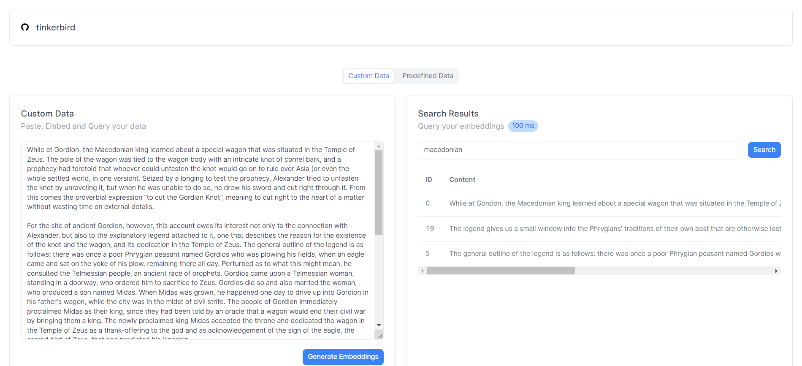

# TinkerBoard: Client-Side Vector Search Library Integration

## Overview

This project illustrates the integration of [TinkerBird](https://github.com/wizenheimer/tinkerbird), a client-side vector search library I created. TinkerBird facilitates fast and efficient vector search operations on the client side, reducing server load. The project features a few dashboards built Tremor and Next.js, offering a practical demonstration of integrating TinkerBird into frontend projects. I've included few text splitters and a mock embeddings function, and could be used as a reference when substituting with an actual text processing and embeddings API.

## Contributing

P.S. I mostly enjoy working at systems and backend stuff, and my front-end skills are decent at best. Contributions are highly encouraged! Feel free to fork the repository, implement changes, and submit a pull request. Meanwhile, I'll be working on optimizing state management and minimizing unnecessary rerenders. Happy Hacking!

## License

This project is licensed under the [MIT License](LICENSE.md).
